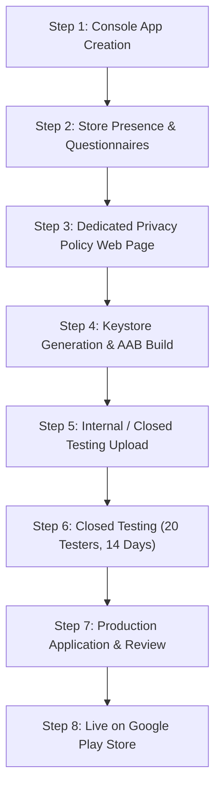

# ArmoryVault Companion: Google Play Publishing & Compliance Guide

This comprehensive guide outlines the end-to-end strategy, technical requirements, policy compliance guidelines, and Play Console deployment process for publishing **ArmoryVault Companion** (`com.armoryvault.companion`) to the Google Play Store.

---

## 1. Google Play Console Account Overview

### A. Personal vs. Organization Developer Accounts
* **Personal Developer Account (Created after Nov 13, 2023)**:
  * **The 20-Tester Rule (Strict Requirement)**: Google enforces a mandatory **Closed Testing** period. You must recruit at least **20 testers** who opt-in to your closed test track and remain actively opted-in for at least **14 consecutive days**.
  * Only after the 14-day mark will the Google Play Console unlock the button to **Apply for Production Access**.
  * During the application, Google asks questions about your testing feedback and what bugs were fixed before approving the app for public release.
* **Organization Developer Account**:
  * Requires an official business identity with an active Dun & Bradstreet (**D-U-N-S**) number.
  * Exempt from the 20-tester / 14-day mandatory waiting period (eligible for direct Open Testing or Production access).

### B. Developer Identity & Console Setup Checklist
1. **Identity Verification**: Submit required legal identity documents (Passport, Driver's License, or Business Registration) in Play Console under **Developer Account > Verification**.
2. **Merchant Account**: Not needed since ArmoryVault Companion is 100% free and open source with zero in-app purchases or subscriptions.
3. **Contact Details**: Set public developer email and website (`https://cook0001.github.io/ArmoryVault/`).

---

## 2. Google Play Firearms & Dangerous Products Policy Compliance

### A. Policy Analysis
Google Play's **Dangerous Products** Policy explicitly states:
> *"We don't allow apps that facilitate the sale of firearms, firearm parts or hardware, ammunition, or certain firearm accessories."*

* **What is strictly forbidden**:
  * Facilitating sales, auctions, trades, or peer-to-peer commerce for firearms, parts, or ammunition.
  * Providing 3D-printing blueprints, CAD files, or instructions for manufacturing lower receivers, auto-sears, or assembling prohibited weapons.
* **What is 100% allowed**:
  * Personal inventory logging, home armory catalogs, maintenance schedules.
  * Range logs, round counts, and chronograph velocity telemetry.
  * Ballistics calculations, trajectory tables, and safe/storage QR code labels.

### B. Required Store Listing Disclaimers
To prevent automated Play Store review bot flags, all public store descriptions must include an explicit compliance statement:

> **IMPORTANT DISCLAIMER**: ArmoryVault is an offline personal inventory and ballistics cataloging tool designed for personal record-keeping and maintenance logging. **ArmoryVault does NOT sell, facilitate the sale of, broker, or trade firearms, ammunition, or firearm parts.** The app contains no marketplace, e-commerce, or manufacturing instructions.

---

## 3. Technical Requirements & Architectural Alignment

| Domain | Current Sideload/GitHub Build | Google Play Store Requirement | Action Required |
| :--- | :--- | :--- | :--- |
| **Package Format** | Standalone `.apk` (129 MB) | **Android App Bundle (`.aab`)** | Build `.aab` via Gradle or EAS Build |
| **Signing Key** | `debug.keystore` (debug key) | **Cryptographic Upload Keystore (`.jks`)** | Generate upload key via `keytool` or EAS Credentials |
| **Install Packages Permission** | `REQUEST_INSTALL_PACKAGES` | **Prohibited on Google Play** (Section 4.5) | Remove from Play Store builds |
| **In-App Updater** | Direct GitHub APK download (`updater.ts`) | **Google Play In-App Updates** (or dormant) | Disable external APK downloader on Play builds |
| **Target SDK** | SDK 35 (Android 15) | Min Target SDK 34 (Android 14) | ✅ Already compliant via Expo SDK 57 |
| **Version Code** | `319` (Strictly monotonic) | Monotonic integer, >= installed | ✅ Already compliant (Rule #8) |
| **Package Name** | `com.armoryvault.companion` | Unique Application ID | Ready to register in Play Console |

### A. Handling `REQUEST_INSTALL_PACKAGES`
Google Play Developer Distribution Agreement (Section 4.5) explicitly bars apps distributed via Google Play from downloading and installing executable APKs from outside the Play Store. Requesting `REQUEST_INSTALL_PACKAGES` triggers an immediate policy rejection.

* **Recommended Strategy**: Dual distribution configuration.
  * **Google Play Build (`.aab`)**: Excludes `REQUEST_INSTALL_PACKAGES`. Update checks via GitHub are either disabled or link users to the Google Play Store listing.
  * **GitHub Release Build (`.apk`)**: Retains `REQUEST_INSTALL_PACKAGES` and [`updater.ts`](file:///Users/danielc/Documents/ArmoryVault_Companion_Stable/utils/updater.ts) for sideloading power-users who prefer air-gapped or non-Play Store installations.

### B. Production Keystore & Play App Signing
1. **Google Play App Signing**: When creating the app in Play Console, opt into **Play App Signing**. Google holds the master deployment key and automatically generates optimized split-APKs for each user's specific CPU architecture and screen density.
2. **Upload Key**: You sign your uploaded `.aab` with an upload keystore. If lost, Google can reset your upload key using account identity verification.

---

## 4. Google Play Store Assets & Metadata Specifications

### A. Graphic Assets
1. **App Icon**:
   * **Size**: 512 × 512 px (32-bit PNG, up to 1 MB).
   * **Current Source**: [`assets/icon.png`](file:///Users/danielc/Documents/ArmoryVault_Companion_Stable/assets/icon.png) (1024 × 1024 source ready for 512x512 downsampling).
2. **Feature Graphic**:
   * **Size**: 1024 × 500 px (JPEG or 24-bit PNG, no alpha, up to 15 MB).
   * **Visual Content**: Dark vault aesthetic (`#0b0f19`), ArmoryVault emerald shield logo, tagline *"Zero-Cloud Firearms, Ammunition & Ballistics Companion"*.
3. **Phone Screenshots**:
   * Minimum of **2 screenshots** (recommend 4–6).
   * **Aspect Ratio**: 9:16 (e.g., 1080 × 1920 px or 1080 × 2400 px).
   * **Recommended Screens**:
     1. Biometric Unlock / Vault Dashboard.
     2. Firearm Inventory / Detailed Specs & Round Counts.
     3. QR Code Barcode Scanner in action.
     4. Ammunition & Magazine Telemetry (+P ratings, shotgun shell specs).
     5. Chronograph String & Velocity Log.
     6. Desktop Local P2P Sync (Zero-Cloud Wi-Fi Pairing).

### B. Store Copy
* **App Name**: `ArmoryVault Companion` (21 / 30 chars)
* **Short Description**: `Zero-cloud offline firearms, ammunition, and ballistics inventory companion.` (78 / 80 chars)
* **Full Description**: Comprehensive breakdown of features, zero-cloud offline security guarantee, local desktop pairing, ATF Bound Book readiness, and mandatory non-commerce disclaimer.

---

## 5. Play Console Policy Questionnaires (Exact Responses)

### 1. Data Safety Declaration
* **Does your app collect or share any of the required user data types?** → **NO**.
* **Is all of the user data collected by your app encrypted in transit?** → **N/A** (No data collected).
* **Do you provide a way for users to request that their data is deleted?** → **YES** (Data deletion is performed directly on-device via Settings > Purge/Reset Local Vault or uninstalling the app).
* *Result*: Google Play grants the official **"No data collected"** and **"No data shared with third parties"** privacy badges.

### 2. Target Audience & Content
* **Target Age**: **18 and older**.
* **Could your app appeal to children?** → **NO**.

### 3. Content Rating (IARC Questionnaire)
* **Category**: Utility, Productivity, Communication, or Other.
* **Violence / Weapons**: Disclose that the app contains references to weapons in a utility/inventory context.
* **Does the app contain violence against humans or animals?** → **NO**.
* **Does the app facilitate the sale of weapons?** → **NO**.
* *Result*: Standard rating (e.g., PEGI 12 / ESRB Everyone / Teen / 18+ depending on weapons references).

### 4. Ads Declaration
* **Does your app contain ads?** → **NO**.

### 5. App Access
* **Are parts of your app restricted (e.g. login credentials)?** → **All functionality is available without special access restrictions**. Note: Vault biometric protection is local to the device.

### 6. Financial Features & Government
* **Financial Features**: None.
* **Government Representation**: None.

### 7. Privacy Policy URL
* Google Play mandates a live public HTTPS URL:
  * Recommended: `https://cook0001.github.io/ArmoryVault/privacy.html`

---

## 6. Step-by-Step Publishing Roadmap

### Step 1: Create the App in Google Play Console
1. Log into [Google Play Console](https://play.google.com/console).
2. Click **Create app**.
3. **App name**: `ArmoryVault Companion`.
4. **Default language**: `English (United States) - en-US`.
5. **App or game**: `App`.
6. **Free or paid**: `Free`.
7. Accept Developer Program Policies and US export laws.

### Step 2: Complete the "Set up your app" Tasks
Complete each required item in the Console Dashboard:
* Set Privacy Policy URL.
* App Access (Unrestricted).
* Ads (No).
* Content Rating (Complete IARC questionnaire).
* Target Audience (18+).
* News app (No).
* COVID-19 tracing (No).
* Data Safety (No data collected or shared).
* Government apps (No).
* Financial features (None).

### Step 3: Publish Dedicated Privacy Policy Page
Deploy `privacy.html` to `ArmoryVault_Desktop/website/` so it is hosted at `https://cook0001.github.io/ArmoryVault/privacy.html`.

### Step 4: Build the Android App Bundle (`.aab`)
* Choose either EAS Build (`eas build --platform android`) or local Gradle bundle (`./gradlew bundleRelease`).
* Sign with your production upload key.
* Ensure `versionCode` is monotonically incremented.

### Step 5: Upload to Closed Testing Track
1. Navigate to **Testing > Closed testing**.
2. Create a track (e.g., `Alpha` or `Closed Beta`).
3. Create a new release and upload the `.aab` file.
4. Add the Google email addresses of your 20 testers.
5. Provide testers with the opt-in web or Play Store link.

### Step 6: Maintain Active Testing for 14 Days
* Testers must stay opted in on their Android devices for 14 consecutive days.
* Collect feedback and release bug-fix updates if necessary.

### Step 7: Apply for Production Access
1. Once the 14-day criteria is met, the **Apply for production** button activates on the Dashboard.
2. Answer the questionnaire detailing tester recruitment and feedback resolution.
3. Submit for Google review (typically takes 2–5 business days).

---

## 7. Dual Build Strategy: Play Store vs. GitHub Sideload

To maintain both GitHub releases and Google Play compliance seamlessly:

| Feature | Play Store Track (`.aab`) | GitHub Release Track (`.apk`) |
| :--- | :--- | :--- |
| **Distribution Channel** | Google Play Store | GitHub Releases / Website Direct Download |
| **File Format** | Android App Bundle (`.aab`) | Universal APK (`.apk`) |
| **Permissions** | Camera, Biometrics | Camera, Biometrics, `REQUEST_INSTALL_PACKAGES` |
| **Updates** | Handled natively by Google Play | Handled by in-app GitHub updater (`updater.ts`) |
| **Target Audience** | General Android users wanting auto-updates | Sideloaders, air-gapped vaults, de-Googled devices |

This dual strategy guarantees maximum reach on Google Play while preserving complete sovereignty and air-gapped utility for security-conscious users.
